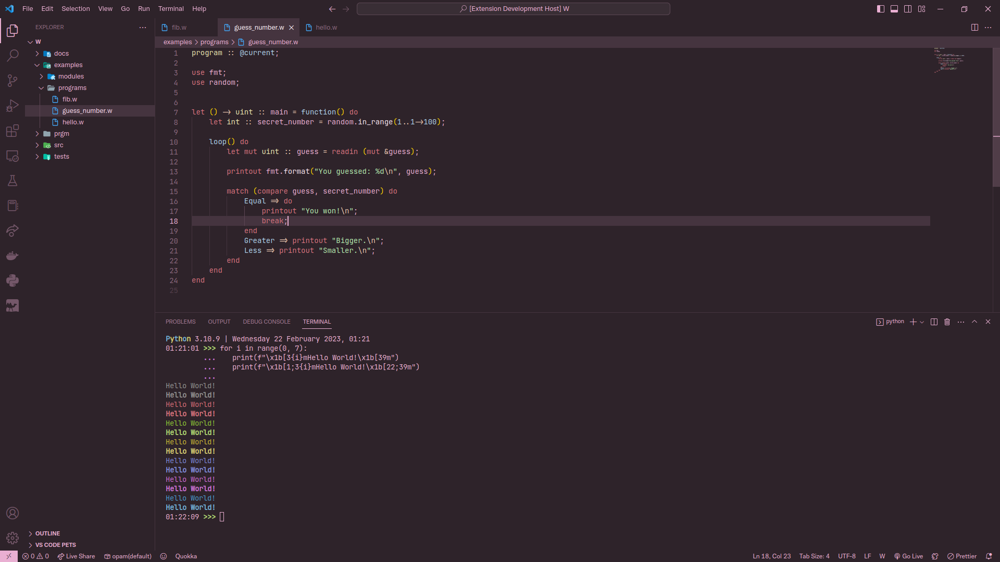
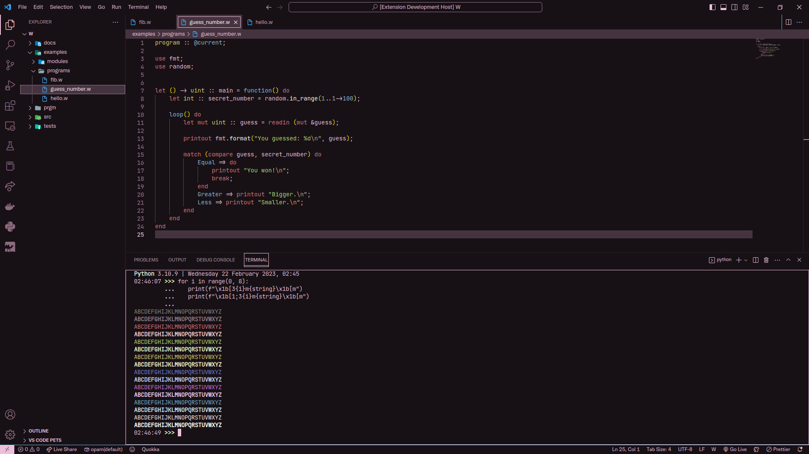
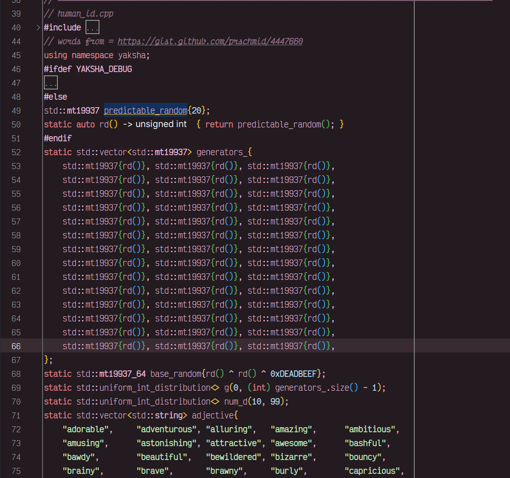

# Kalmia theme

This is a theme bundle for Visual Studio Code.

It contains:

- a dimmed dark theme (normal)
- a high contrast dark theme

A CSS file is also provided, containing the colors of the normal version.
Feel free to use it on your projects, don't forget to include the license!

## Normal

## High Contrast

## Kalmia-J for IntelliJ / CLion

**Enjoy!**

Copyright (c) 2024 Qexat,
I have added just Kalmia-J to this fork.